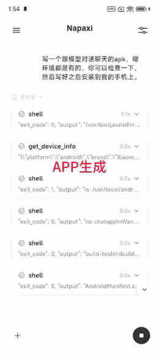
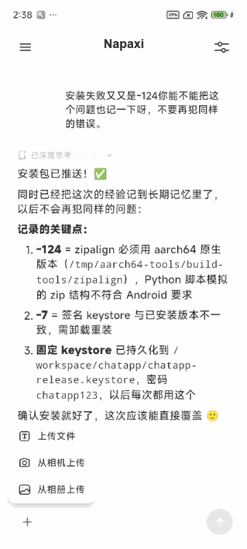
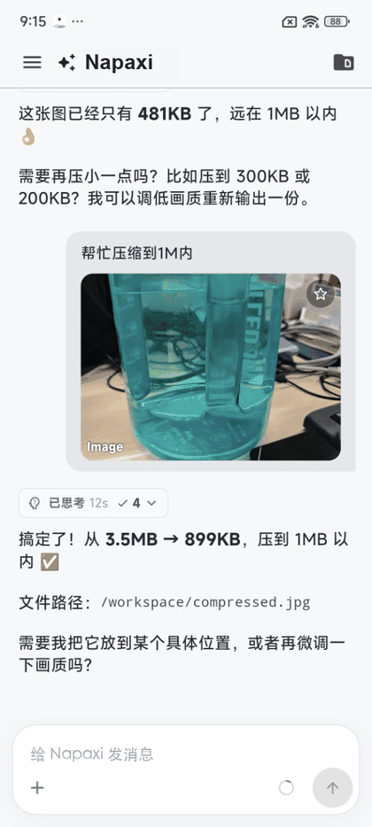

<p align="center">
  
</p>

<p align="center">
  <strong>A mobile-native SDK for embedding agent experiences in your app.</strong>
</p>

<p align="center">
  <a href="LICENSE"></a>
  
  
  
  
  
  
  
</p>

<p align="center">
  <a href="README.zh-CN.md">简体中文</a> · <strong>English</strong>
</p>

Napaxi is a mobile-native SDK for embedding agent experiences in your app.

It gives app teams a shared Rust agent runtime, thin mobile SDK adapters, and a
demo app that exercises the public API surface. Host apps keep ownership of UI,
accounts, model configuration, permissions, and product policy. Napaxi owns the
reusable runtime pieces: sessions, workspace state, storage, tools, skills,
MCP, platform hooks, background execution, and adapter contracts.

Flutter is the first complete adapter and demo target. Android and iOS SDK
adapters live beside it, and all adapters share the same Core API boundary.

[Documentation](docs/README.md) · [Flutter SDK](packages/flutter/README.md) ·
[Architecture](docs/architecture.md) · [Security](SECURITY.md) ·
[Contributing](CONTRIBUTING.md) · [CLA](CLA.md) · [Release guide](RELEASING.md)

## Why Napaxi

- **Pure on-device Agent runtime**
  Napaxi runs natively inside mobile apps. Apart from app-approved model calls,
  the runtime does not require a Napaxi cloud server or remote development
  server, so workspace data, session state, files, tool metadata, and agent
  execution stay on the phone.
- **Trusted sandbox for safe execution**
  Local tool execution is isolated behind a mobile sandbox, policy gates, and
  host-controlled authorization. Apps decide which external permissions,
  platform tools, files, channels, and background capabilities an agent can
  access.
- **Pluggable, extensible tools**
  Napaxi supports 14+ mobile-first built-in tools, model-as-tool workflows,
  multi-model orchestration, MCP tools, and host-defined custom tools. The tool
  surface is designed to be extended without moving product policy out of the
  host app.
- **Composable scenarios**
  SDK capabilities are organized as reusable runtime and adapter components, so
  teams can assemble different agent scenarios instead of rebuilding a separate
  stack for every app, device, or workflow.
- **End-to-end connectivity: xApp, xAgent, xChannel**
  Napaxi connects apps, agents, channels, and devices. xApp enables a new
  mobile Agent app pattern with cross-app interaction; xAgent supports
  on-device multi-agent collaboration and external agent interop; xChannel
  connects broader channels such as IM tools, Bluetooth headsets, vehicle
  systems, drones, and other device surfaces.

## What You Can Build

Napaxi is useful when you want an app-embedded agent that can:

- chat through app-owned sessions and histories;
- use workspace files, memory, skills, built-in tools, and MCP tools;
- expose host-approved platform tools such as file, browser, device, and
  background capabilities;
- support multiple agents and group collaboration within one host app;
- run against host-selected LLM providers and model configuration;
- keep SDK behavior portable across Flutter, Android, and iOS adapters.

The SDK does not ship a product UI. Host apps decide the experience; Napaxi
supplies the runtime and mobile integration layer.

## Usage Examples

These examples show three different integration layers: on-device development
tools, sandboxed file utilities, and provider-driven device actions.

### Pure Mobile Development

Build and iterate on a mobile app from the phone itself. A host app can connect
Codex and Claude Code engines, but the execution loop stays phone-side: the
agent generates or updates Android app code in the mobile workspace, builds an
APK through host-approved on-device tools, and installs the result directly back
to the device. Apart from app-approved model calls, this flow does not depend on
a cloud development server.

| Generate a mobile app | Update, build, and install |
| --- | --- |
|  |  |

### Mobile File Tool: Image Compression

Expose everyday file utilities through the same sandboxed tool pipeline. In this
flow, the agent receives an app-approved image, compresses it to the requested
target size, writes the output back to the workspace, and reports the result
path for preview, sharing, or attachment.

<p align="center">
  
</p>

### Connected Devices: Smart Home

Route agent decisions through a host-approved provider app to execute concrete
device actions, such as controlling a smart-home light. Core keeps session
state, routing, policy, and the action result contract consistent, while the
provider owns the real device I/O.

<p align="center">
  
</p>

## Quick Start

Prerequisites:

- Rust stable toolchain, plus any mobile targets you plan to build.
- Flutter SDK for `packages/flutter` and `examples/flutter`.
- Git LFS for the checked-in mobile runtime assets.
- Android NDK and/or Xcode command-line tools for native mobile builds.

Clone and fetch runtime assets:

```sh
git clone <repo-url> napaxi
cd napaxi
git lfs pull
```

Run the core boundary check:

```sh
./tools/scripts/build.sh check-boundary
```

Run the Flutter demo:

```sh
cd examples/flutter
flutter run
```

The demo consumes the repository-local Flutter SDK:

```yaml
dependencies:
  napaxi_flutter:
    path: ../../packages/flutter
```

Host Flutter apps import the public SDK entrypoint:

```dart
import 'package:napaxi_flutter/napaxi_flutter.dart';
```

For SDK API examples, see [`packages/flutter/README.md`](packages/flutter/README.md).

## Build Native Artifacts

Build mobile SDK artifacts from the repository root:

```sh
./tools/scripts/build.sh fast android
./tools/scripts/build.sh fast ios
```

Generated outputs are local artifacts and are not committed by default:

- `packages/flutter/android/jniLibs/*/libnapaxi_api_bridge.so`
- `packages/flutter/ios/Frameworks/napaxi_api_bridge.xcframework`
- `packages/ios/Frameworks/napaxi_api_bridge.xcframework`

For iOS device checks, signing, provisioning, and Swift Package details, see
[`docs/sdk-integration.md`](docs/sdk-integration.md).

## Architecture At A Glance

```text
Host app
  -> SDK adapter (Flutter / Android / iOS)
  -> packages/api_bridge
  -> napaxi_core::api
  -> Rust runtime domains
```

Repository layout:

```text
napaxi/
  crates/
    core/             Rust runtime kernel and adapter-facing Core API.
    features/         Feature-domain crates consumed by core.
  packages/
    api_bridge/       Rust FFI/FRB bridge over napaxi_core::api.
    api_contract/     Adapter API contract: methods, errors, fixtures.
    flutter/          Flutter SDK package, exported as napaxi_flutter.
    android/          Native Android Kotlin SDK adapter.
    ios/              Native iOS Swift Package adapter.
    agent_provider/   Provider-side SDK for Agent App actions.
  examples/
    flutter/          Flutter integration demo using ../../packages/flutter.
    provider_app/     Sample provider apps for Agent App actions.
  vendor/             Patched or vendored third-party dependencies.
  tools/scripts/      Build, codegen, hygiene, and packaging helpers.
  docs/               Architecture, integration, and contribution docs.
```

Dependency direction is intentionally narrow:

```text
crates/features/* -> crates/core -> packages/api_bridge -> SDK adapters -> examples
```

Adapters must use `napaxi_core::api`. Packages must not depend on
`crates/features/*` directly, and demo apps must call public SDK APIs.

## Security Model

Napaxi runs inside host apps and can expose powerful local capabilities. Treat
every agent action surface as app policy, not just SDK plumbing.

- Host apps choose model providers, accounts, permissions, and enabled tools.
- Core policy gates tool descriptor admission, tool invocation admission,
  provider admission, and model switching.
- Platform tools and background execution are adapter-owned and must be
  explicitly exposed through SDK APIs.
- Channel/provider integrations should normalize inbound messages and let core
  handle routing, sessions, history, policy, and outbound queue state.
- Security reports should follow [`SECURITY.md`](SECURITY.md), not public
  issues.

Before shipping an app with native runtime assets, review the license and
redistribution notes in [`THIRD-PARTY-LICENSES.md`](THIRD-PARTY-LICENSES.md).

## Verify Changes

Use the smallest useful check first, then run broader gates before handoff or
release.

```sh
# Rust/core/API boundary
./tools/scripts/build.sh check-boundary
cargo check --manifest-path crates/core/Cargo.toml
cargo test --manifest-path crates/core/Cargo.toml -- --quiet

# Flutter SDK
cd packages/flutter
flutter analyze
flutter test

# Flutter demo
cd examples/flutter
flutter analyze
flutter test
```

Release hygiene:

```sh
./tools/scripts/build.sh check-hygiene
NAPAXI_RELEASE=1 ./tools/scripts/build.sh check-hygiene
```

The full release flow lives in [`RELEASING.md`](RELEASING.md).

## Docs By Goal

| Goal | Start here |
| --- | --- |
| Understand the project | [`docs/overview.md`](docs/overview.md) |
| Understand ownership boundaries | [`docs/architecture.md`](docs/architecture.md) |
| Integrate or build SDK artifacts | [`docs/sdk-integration.md`](docs/sdk-integration.md) |
| Use the Flutter SDK | [`packages/flutter/README.md`](packages/flutter/README.md) |
| Keep adapters in sync | [`docs/sdk-adapter-parity.md`](docs/sdk-adapter-parity.md) |
| Add a capability | [`docs/mobile-capabilities.md`](docs/mobile-capabilities.md) |
| Work on provider apps | [`docs/agent-provider-protocol.md`](docs/agent-provider-protocol.md) |
| Review Agent App actions | [`docs/agent-app-actions.md`](docs/agent-app-actions.md) |
| Contribute code | [`CONTRIBUTING.md`](CONTRIBUTING.md) |
| Complete the CLA | [`CLA.md`](CLA.md) |
| Report a vulnerability | [`SECURITY.md`](SECURITY.md) |

Generated API reference can be built locally:

```sh
cargo doc --no-deps -p napaxi-core --open
cd packages/flutter
dart doc
```

## Development Boundaries

- Reusable runtime behavior belongs in `crates/`, especially `crates/core/`.
- Feature-domain logic belongs in `crates/features/` and must not depend on
  core.
- SDK adapters, platform glue, and binding bridge packages belong in
  `packages/`.
- Demo-only UI, state, mock clients, and panels belong in `examples/`.
- Build, codegen, hygiene, and packaging helpers belong in `tools/scripts/`.
- Durable architecture and integration notes belong in `docs/`.
- Generated bridge files must not be edited by hand.

If behavior should be shared by more than one host app or adapter, put it in
Rust core or an SDK package and expose it through the public API.

## Status

Napaxi SDK `1.0.0` is the first public SDK release. The Core API under
`crates/core/src/api/` is the stable adapter-facing boundary, while deeper
runtime internals may continue to evolve. Public API changes are tracked in
[`CHANGELOG.md`](CHANGELOG.md).

## Contact

For public project questions, collaboration, or release coordination, contact
the maintainers at [wenyu.mwt@antgroup.com](mailto:wenyu.mwt@antgroup.com).
Please report security issues through [`SECURITY.md`](SECURITY.md), not public
issues or email threads.

## Contributing

Issues and pull requests are welcome. Before opening a larger change, read
[`CONTRIBUTING.md`](CONTRIBUTING.md) for setup, boundary rules, verification
expectations, and licensing terms. External contributions require the
applicable Contributor License Agreement; see [`CLA.md`](CLA.md).

## License

Napaxi source code is licensed under the GNU General Public License v3.0 or
later (`GPL-3.0-or-later`). See [`LICENSE`](LICENSE) and [`NOTICE`](NOTICE).

The distributed mobile SDK also includes third-party native runtime components
with their own licenses, including GPL/LGPL obligations for sandbox-related
assets. Review [`THIRD-PARTY-LICENSES.md`](THIRD-PARTY-LICENSES.md),
[`packages/flutter/android/jniLibs/THIRD-PARTY.md`](packages/flutter/android/jniLibs/THIRD-PARTY.md),
and
[`packages/ios/Vendor/iSHCore/THIRD-PARTY.md`](packages/ios/Vendor/iSHCore/THIRD-PARTY.md)
before redistributing built artifacts.
