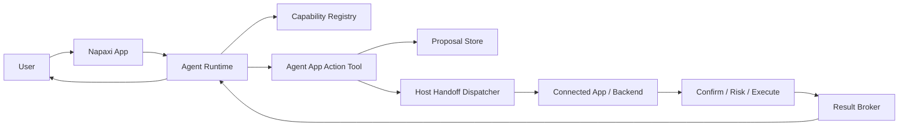

# Agent App Actions

Napaxi turns user intent into auditable `ActionProposal` records. The connected
app or backend owns provider confirmation, risk checks, execution, and trusted
result return.



## Capability

Agent App actions are carried by one compiled capability:
`napaxi.tool.agent_app_action`.

- `kind`: `tool`
- `activation`: `host`
- `risk`: `high` by default
- `requirements`: `host_action_dispatcher`,
  `provider_confirmation_for_high_risk`

The host must declare and enable this capability through the engine host
profile and capability selection. Flutter does this automatically when
`NapaxiEngine.create(agentAppActionExecutor: ...)` is supplied. Native Android
does this automatically when `NapaxiEngine.create(context = activity, ...)`
receives an `Activity`, which installs the default provider action dispatcher;
non-Activity Android contexts should supply a custom `AgentAppActionExecutor`.

Concrete provider actions are package data, not dynamic native plugins. Action
tool names must start with `app_action_`, which maps descriptor and invocation
admission to `napaxi.tool.agent_app_action`.

## Package

`AgentAppPackage` binds provider action data to one Agent:

```json
{
  "provider_id": "app_action_provider",
  "agent_id": "agent_app.agent",
  "display_name": "Agent App",
  "description": "Agent backed by a connected app or service.",
  "system_prompt": "...",
  "actions": [],
  "handoff": {},
  "result": {}
}
```

Registering a package persists it under the core files dir and creates or
updates the matching `AgentDefinition`. During a turn, only the current Agent's
package actions are exposed as descriptors. Other Agents cannot see them.

## Proposal And Result

When a model calls an Agent App action tool, core stores an
`ActionProposal`, dispatches it to the host, and later records an
`ActionResult`. Proposals include `request_id`, `nonce`, `idempotency_key`,
`created_at`, and `expires_at` so app handoff, system suspension, and delayed
callbacks can be recovered.

When an Android provider was installed with protocol v2 trust fields, core also
signs proposals with `hmac-sha256-v1`. The signature covers provider, agent,
action, tool, canonical argument hash, expiry, nonce, idempotency key, risk,
confirmation policy, and `host_instance_id`. Host dispatchers must not send the
shared secret to the provider action Activity.

The host dispatcher receives a JSON payload with:

- `proposal`: the persisted action proposal.
- `action`: the action manifest that produced the tool descriptor.
- `package`: provider, agent, handoff, and result metadata.

The dispatcher returns an `ActionResult` JSON object. Core validates that the
proposal exists, rejects successful results after expiry, persists the result,
and returns a tool result back into the model loop.
Already terminal proposals do not accept later duplicate successful results.

## Events

Agent App actions emit lifecycle events for UI, debug views, and background
notifications:

- `action_proposal_created`
- `action_handoff_started`
- `action_waiting_for_provider`
- `action_result_received`
- `action_expired`
- `action_failed`

Business output still flows through the normal tool result, so the Agent can
generate a final natural-language response.

## Repo Ownership

- `crates/core/src/capabilities/`: generic capability definition and tool name
  mapping.
- `crates/core/src/agents/agent_app.rs`: package store, action descriptors,
  proposal persistence, result broker, and host dispatcher call.
- `crates/core/src/runtime/`: per-Agent tool composition and capability-gated
  descriptor/invocation flow.
- `crates/core/src/api/agent_app.rs`: adapter-neutral package, proposal, and
  result APIs.
- `packages/api_bridge/`: thin FRB forwarding only.
- `packages/flutter/lib/`: Dart models, `AgentAppApi`, and
  `McAgentAppActionExecutor`.
- `packages/android/src/main/kotlin/com/napaxi/android/`: Kotlin models,
  `AgentAppApi`, provider install/trigger helpers, and the default Activity
  action dispatcher.

Demo apps may install mock packages and mock dispatchers for validation, but
reusable policy and runtime behavior must remain in core or SDK packages.
