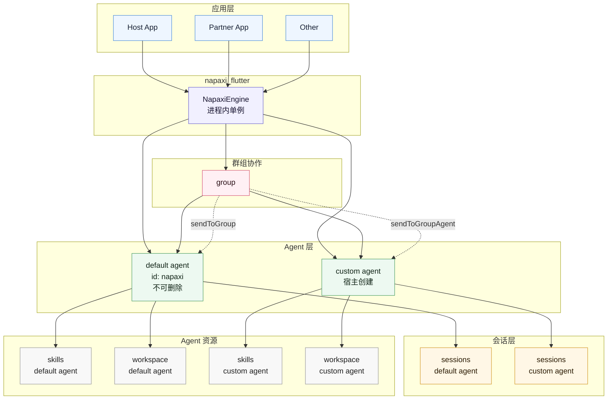

# Napaxi Flutter SDK

Napaxi SDK 是 Napaxi 端侧 Agent 能力的 Flutter 接入层。SDK 不包含 UI，宿主 App 负责页面、状态管理、账号和模型配置；SDK 负责连接 Rust core，提供 Agent 对话、会话、技能、多 Agent、群组协作、workspace、sandbox 文件桥接和后台执行能力。

## 架构

```text
宿主 Flutter 应用
  -> napaxi_flutter Dart API
  -> flutter_rust_bridge
  -> packages/api_bridge/bridge
```

- `napaxi-core` 是 Android、iOS、Flutter 共用的 Rust 核心能力层。
- `packages/api_bridge` 是 Flutter Rust Bridge 绑定层，作为独立 crate 依赖 napaxi-core。
- `napaxi_flutter` 是 Flutter plugin 壳，`packages/api_bridge` 是对应的 Rust crate。
- `lib/generated` 是自动生成代码，不要手改。
- Dart 侧只保留 Flutter 插件胶水、后台服务、平台权限和少量 public API wrapper。

## 核心概念



`NapaxiEngine` 在宿主进程内按单例使用。SDK 当前不强制单例，但宿主 App 应只创建并持有一个 engine 实例，退出 Agent 能力或 App 销毁时调用 `dispose()`。

Engine 下可以创建多个 Agent。默认 Agent 固定存在，兼容 ID 为 `NapaxiEngine.defaultAgentId`（当前值 `"napaxi"`），业务上称为 default agent。default agent 不能删除，`deleteAgent(NapaxiEngine.defaultAgentId)` 会返回 `false`。

每个 Agent 可以拥有自己的会话列表、历史和发送流程。所有 session API 都支持可选 `agentId`，不传时默认使用 default agent。

SDK 中需要持久化到 DB 的 Agent 资源通常同时按 `accountId` 和 `agentId` 分区。`accountId` 对应宿主 App 的当前账号或会话用户，`agentId` 对应 default agent 或自定义 Agent。调用 workspace API 时应传入和 `createSession(accountId: ...)` 相同的 `accountId`，这样文件页、system prompt 组装以及 `memory_read` / `memory_write` 工具才能读写同一套记忆文件。

Group 表示多个 Agent 的协作空间：

- `sendToGroup` 向整个群组发送消息，由群组 coordinator 和协作路由决定成员响应。
- `sendToGroupAgent` 先校验目标 Agent 属于该 group，再向该 Agent 的指定 session 直发消息。

## 接入方式

在宿主 Flutter App 的 `pubspec.yaml` 中添加 SDK 发布仓库依赖：

```yaml
dependencies:
  napaxi_flutter:
    git:
      url: <napaxi_flutter_release_repo_url>
      ref: <version_or_branch>
```

本地联调时也可以使用 path 依赖，例如 `path: ../napaxi_flutter_release`。

初始化引擎：

```dart
import 'package:napaxi_flutter/napaxi_flutter.dart';

final engine = await NapaxiEngine.create(
  config: LlmConfig(
    provider: 'openai',
    apiKey: apiKey,
    model: 'gpt-4o',
    systemPrompt: 'You are Napaxi, a helpful AI assistant.',
    responseLanguage: 'en',
  ),
);

engine.ensureAgent();
```

宿主 App 创建自定义 Agent 后，为指定 Agent 创建会话并发送消息：

```dart
final customAgent = await engine.getOrCreateAgent('research');
final session = await engine.createSession(
  agentId: customAgent.agentId,
  channelType: 'app',
  accountId: userId,
);

engine.sendToSession(
  session,
  '帮我整理这份调研材料',
  agentId: customAgent.agentId,
).listen((event) {
  // Render ChatEvent in your app UI.
});
```

发送消息并监听事件：

```dart
engine.sendToSession(session, '帮我分析这个任务').listen((event) {
  switch (event) {
    case ResponseEvent(:final content):
      print(content);
    case ToolCallEvent(:final name):
      print('tool: $name');
    case ErrorEvent(:final message):
      print('error: $message');
    default:
      break;
  }
});
```

销毁：

```dart
engine.dispose();
```
## 能力状态

| 能力 | 状态 | 说明 |
| --- | --- | --- |
| Engine 初始化与销毁 | 已支持 | 宿主 App 应按单例持有 `NapaxiEngine`。 |
| Default agent | 已支持 | ID 为 `"napaxi"`，不能删除，旧 API 默认走它。 |
| 多 Agent 专家切换 | V1 支持 | `getOrCreateAgent`、`listAgents`、`deleteAgent`；建议显式传同一个 `agentId`。 |
| Agent-scoped session | V1 支持 | create/send/list/history 按 `agentId` 隔离；新建或恢复 session 时会记录 `agent_id`，用于跨 App 重启恢复列表。 |
| Agent-scoped workspace | V1 支持 | Workspace 按 `accountId + agentId` 分区。 |
| Group 创建与成员管理 | Experimental | 创建 group 前成员 Agent 需要已存在。 |
| Group coordinator 路由 | Experimental | `sendToGroup` 入口可用，当前 coordinator 仍是 default agent。 |
| Group 内指定 Agent 直发 | Experimental | `sendToGroupAgent` 会校验 group membership 后发送。 |
| Default agent 重命名 | 暂不支持 | 当前兼容 ID 固定为 `"napaxi"`。 |

## 核心 API

### Engine

- `NapaxiEngine.create(config, toolExecutor?, toolApprovalHandler?, enablePlatformTools?, backgroundConfig?)`
- `updateConfig(LlmConfig newConfig)`
- `ensureAgent()`
- `dispose()`

`LlmConfig` 字段包括 `provider`、`apiKey`、`baseUrl`、`model`、`systemPrompt`、`responseLanguage`（`en`/`zh`，默认 `en`）、`maxTokens`、`extraHeaders`、`allowedModels`、`imageModel`、`userTimezone`。
`userTimezone` 是可选 IANA 时区，例如 `Asia/Shanghai`，用于让 core 在 prompt 中解释“明天上午”等用户本地时间意图；SDK 的存储、wire 值和时间戳仍使用 UTC/epoch。SDK 不会替宿主自动选择用户时区，Flutter demo 会默认读取系统时区并显式传入配置。

### Chat / Session

- `send(message, attachments?, maxIterations?)`
- `sendToSession(sessionKey, message, agentId?, attachments?, sandboxPaths?, userMsgIndex?, maxIterations?)`
- `injectMessage(sessionKey, message, agentId?, attachments?)`
- `cancelSession(sessionKey, agentId?)`
- `createSession(agentId?, channelType?, accountId?, threadId?)`
- `listSessions(agentId?, accountId?)`
- `deleteSession(sessionKey, agentId?)`
- `clearSession(sessionKey, agentId?)`
- `getHistory(threadId, agentId?)`
- `saveAttachmentMetadata(threadId, userMsgIndex, attachments)`

`agentId` 默认是 `NapaxiEngine.defaultAgentId`。多 Agent 场景下建议创建 session、发送消息、查询 history 时都显式传入同一个 `agentId`。

主要类型：

- `SessionKey`
- `SessionInfo`
- `ChatMessage`
- `ChatAttachment`
- `McAttachment`
- `ChatEvent`

常见事件：

- `ResponseEvent`
- `ThinkingEvent`
- `ToolCallEvent`
- `ToolResultEvent`
- `ErrorEvent`
- `ImageGeneratedEvent`
- `AskingHumanEvent`
- `MessageInjectedEvent`
- `AgentDelegationEvent`
- `GroupDelegationEvent`

### Custom Tools

宿主 App 可以实现 `McToolExecutor` 来处理自定义工具：

```dart
class AppToolExecutor extends McToolExecutor {
  @override
  Future<String> execute(String toolName, String paramsJson) async {
    return '{"ok":true}';
  }
}
```

注册工具：

```dart
engine.updateCustomTools([
  CustomToolDef(
    name: 'query_order',
    description: 'Query user order by id.',
    parameters: {
      'type': 'object',
      'properties': {
        'order_id': {'type': 'string'},
      },
      'required': ['order_id'],
    },
  ),
]);
```

`NapaxiEngine.create` 会自动启动工具请求监听；如果宿主需要手动重启监听，也可以调用
`engine.startToolRequestListener()`。

### Tool Approval

高风险 builtin 工具会通过宿主 App 请求用户授权。当前首先接入的是移动端 shell
工具；没有配置授权处理器时，这类命令会安全失败。

```dart
final engine = await NapaxiEngine.create(
  config: config,
  toolApprovalHandler: (request) async {
    final command = request.parameters['command'] as String? ?? '';
    final approved = await showApprovalDialog(command);
    return McToolApprovalResponse(
      approved: approved,
      message: approved ? null : 'User denied shell command',
    );
  },
);
```

### Platform Tools

设置 `enablePlatformTools: true` 后，SDK 会注册移动端平台工具。Rust core 负责工具定义、路由和错误包装；具体系统能力由 Flutter 插件或原生侧执行。

当前内置工具包括：

- `open_url`
- `make_call`
- `send_sms`
- `get_clipboard`
- `set_clipboard`
- `get_device_info`
- `get_location`
- `send_notification`
- `get_contacts`
- `create_calendar_event`
- `list_calendar_events`
- `take_photo`
- `record_audio`
- `set_alarm`
- `install_apk`

### Skill / Catalog

- `listSkills(agentId?)`
- `getSkill(skillName, agentId?)`
- `installSkill(skillContent, agentId?)`
- `removeSkill(skillName, agentId?)`
- `reloadSkills(agentId?)`
- `searchCatalog(query)`
- `getCatalogSkill(slug)`
- `installFromCatalog(slug, agentId?)`

主要类型：

- `SkillInfo`
- `SkillInstallResult`
- `CatalogSearchResult`
- `CatalogSkillInfo`
- `ToolInfo`

### Agent Definition

- `createAgentDefinition(def)`
- `listAgentDefinitions()`
- `getAgentDefinition(defId)`
- `updateAgentDefinition(def)`
- `deleteAgentDefinition(defId)`
- `importAgentMd(content)`
- `listAvailableTools()`
- `createAgentFromDefinition(defId, config?)`

主要类型：

- `AgentDefinition`
- `AgentHandle`
- `ToolFilter`

兼容性语义：

- `AgentDefinition.modelProfileId` / JSON `model_profile_id` 可选；用于宿主 App 将 Agent 绑定到配置中心里的某个模型 Profile。SDK 只持久化这个引用，不保存 API Key。
- `AgentDefinition.provider`、`AgentDefinition.model` 可不传；不传或为空时，运行实例继承当前 engine 的全局模型配置。
- `AgentDefinition.systemPrompt` 可不传；不传或为空时，运行实例继承当前 engine 的全局 system prompt。
- 以上均不改变现有方法签名；需要纯 SDK 低层按 Agent 固定模型时，再显式填写 `provider` / `model`。

模型配置建议分层：

- 配置页面或宿主配置中心管理 API Key、Base URL、Provider、可用模型和默认聊天模型。
- AgentDefinition 只保存可选的 `modelProfileId`、`systemPrompt` 和工具策略等使用偏好。
- 运行时由宿主 App/Dart 层把 `modelProfileId` 解析成实际 `LlmConfig` 后调用 `updateConfig` / send API；`modelProfileId` 为空或失效时回退全局默认模型。

### Multi-Agent / Group

Agent：

- `getOrCreateAgent(agentId, config?)`
- `listAgents()`
- `deleteAgent(agentId)`，default agent 不能删除
- `agentSend(agent, session, message, config?, maxIterations?)`

`agentSend` 保留用于兼容；新接入建议优先使用带 `agentId` 的 `createSession` 和 `sendToSession`。

V1 推荐使用“专家切换”模式：默认只有 `napaxi`，自定义 Agent 由宿主 App 通过 AgentDefinition 或 `getOrCreateAgent` 创建。宿主 App 选择当前 `agentId` 后，将同一个 `agentId` 传给 session、history、skill、workspace 相关 API。Group/coordinator 仍属于 experimental 能力，不建议作为首屏主流程。

Group：

- `createGroup(name, memberAgentIds)`
- `deleteGroup(groupId)`
- `listGroups()`
- `getGroup(groupId)`
- `renameGroup(groupId, newName)`
- `updateGroupMembers(groupId, memberAgentIds)`
- `setGroupCustomPrompt(groupId, prompt)`
- `getGroupMessages(groupId)`
- `clearGroupHistory(groupId)`
- `sendToGroup(groupId, message, maxIterations?)`
- `sendToGroupAgent(groupId, agentId, session, message, maxIterations?)`
- `exportGroupState()`
- `importGroupState(stateJson)`

主要类型：

- `GroupInfo`
- `GroupMessage`
- `GroupMessageType`

### Workspace

Workspace 用于 Agent 的人格、记忆和系统提示词文件。

- `readWorkspaceFile(path, accountId?, agentId?)`
- `writeWorkspaceFile(path, content, accountId?, agentId?)`
- `appendWorkspaceFile(path, content, accountId?, agentId?)`
- `deleteWorkspaceFile(path, accountId?, agentId?)`
- `listWorkspaceFiles(directory, accountId?, agentId?)`
- `getSystemPrompt(accountId?, agentId?)`
- `reseedWorkspace(accountId?, agentId?)`

`accountId` 默认是 `"flutter_user"`，用于兼容旧调用；宿主 App 如果会话使用了其它账号 ID，应显式传同一个值。`agentId` 默认是 `NapaxiEngine.defaultAgentId`。例如：

```dart
const accountId = 'flutter_user';
const agentId = NapaxiEngine.defaultAgentId;

final session = await engine.createSession(
  channelType: 'app',
  accountId: accountId,
  agentId: agentId,
);

await engine.writeWorkspaceFile(
  WorkspacePaths.identity,
  '# Identity\n...',
  accountId: accountId,
  agentId: agentId,
);

final identity = await engine.readWorkspaceFile(
  WorkspacePaths.identity,
  accountId: accountId,
  agentId: agentId,
);
```

常用路径在 `WorkspacePaths` 中：

- `WorkspacePaths.soul`
- `WorkspacePaths.identity`
- `WorkspacePaths.agents`
- `WorkspacePaths.user`
- `WorkspacePaths.memory`
- `WorkspacePaths.tools`
- `WorkspacePaths.bootstrap`

### Sandbox / File Bridge

`NapaxiFileBridge` 用于把 Agent 输出中的 Linux sandbox 路径映射到真实设备文件。
当调用方要读取当前 Agent 的 `/workspace` 时，优先使用 scoped API，并传入
和 engine/session 相同的 `accountId` 与 `agentId`：

- `NapaxiFileBridge.instance.workspaceDirScoped(accountId: ..., agentId: ...)`
- `sandboxToRealScoped(path, accountId: ..., agentId: ...)`
- `realToSandboxScoped(path, accountId: ..., agentId: ...)`
- `deleteFileScoped(sandboxPath, accountId: ..., agentId: ...)`
- `detectFileReferencesScoped(text, accountId: ..., agentId: ...)`
- `listFilesScoped(accountId: ..., agentId: ..., subdir?, recursive?)`
- `workspaceSizeScoped(accountId: ..., agentId: ...)`

非 scoped API（如 `sandboxToReal`、`listFiles`、`deleteFile`）仍保留给旧接入方
和不带 Agent scope 的全局 workspace 使用。新代码不要用它们读取聊天会话里的
Agent 文件，否则会落到全局 app workspace，而不是当前 Agent scope。

路径规则：

- scoped `/workspace/...` -> app filesDir 下的
  `napaxi_scopes/accounts/<accountId>/agents/<agentId>/linux-env/workspace`
- 非 scoped `/workspace/...` -> app filesDir 下的 `linux-env/workspace`
- `/skills/...` -> app filesDir 下的 `prompt_skills`
- `/tmp`、`/root`、`/home`、`/var`、`/usr`、`/opt`、`/etc`、`/srv`、`/run` -> rootfs
- Android rootfs 默认在 `filesDir/linux-env/rootfs`
- iOS rootfs 默认在 `Documents/ish-rootfs`

### Sandbox

Android Linux sandbox 和 iOS sandbox/rootfs 均由 SDK 在 engine 创建时内部初始化。Flutter 接入方不需要也不应该直接调用 sandbox setup/install API。

### Background Execution

后台执行用于 Android foreground service 场景。

- `BackgroundConfig`
- `NotificationConfig`
- `NapaxiBackgroundController`
- `NapaxiBackgroundPermissions`
- `engine.startBackgroundService()`
- `engine.stopBackgroundService()`
- `engine.updateBackgroundConfig(config)`
- `engine.onBackgroundAction`

### Automation

Automation 是移动端主动 Agent 的 SDK contract。Rust core 负责持久化任务、计算
下一次唤醒时间、记录 run log、执行 `systemEvent` / `agentTurn`，宿主 App 负责
真实系统调度、权限和通知展示。

- `engine.automation.createAutomationJob(job)`
- `engine.automation.updateAutomationJob(jobId, patch)`
- `engine.automation.deleteAutomationJob(jobId)`
- `engine.automation.listAutomationJobs(...)`
- `engine.automation.getAutomationJob(jobId)`
- `engine.automation.runAutomationJob(jobId, mode: 'manual' | 'due' | 'force')`
- `engine.automation.listAutomationRuns(...)`
- `engine.automation.getNextAutomationWake()`
- `engine.automation.recordAutomationWake(jobId, source)`

V1 trigger 包括 one-shot、interval、manual 和 host event。Android 可由宿主用
WorkManager/AlarmManager 唤醒后调用 `recordAutomationWake`；iOS 不承诺精确定时
后台 LLM 执行，建议用本地通知、push 或 foreground handoff 唤醒后再执行。

## Flutter App 注意事项

- 宿主 App 只依赖 `package:napaxi_flutter/napaxi_flutter.dart`。
- 不要直接 import `lib/generated`。
- 不要手改自动生成文件。
- 如果启用 `enablePlatformTools`，宿主 Flutter App 仍需要在 Android/iOS 工程里配置对应系统权限，例如定位、联系人、相机、通知等。
- Android/iOS sandbox/rootfs 由 SDK 内部集成链路提供，Flutter 接入方只需要使用 SDK 暴露的 Dart API。

## 开发与构建

生成 Flutter Rust Bridge 代码：

```bash
flutter_rust_bridge_codegen generate --no-dart-format --no-dart-fix --no-rust-format
```

或：

```bash
../../tools/scripts/build.sh release codegen
```

构建 Android arm64：

```bash
../../tools/scripts/build.sh fast android
```

构建 iOS：

```bash
../../tools/scripts/build.sh fast ios
```

构建 Android + iOS：

```bash
../../tools/scripts/build.sh release all
```

常用检查：

```bash
cargo check -p napaxi_flutter

flutter analyze --no-pub --no-fatal-infos
```

## 发布仓库同步

独立发布仓库只面向 Flutter SDK 使用者，不包含 Rust 源码。Rust 从 `packages/api_bridge` 编译，编译完成后把预编译产物同步到发布仓库。

重新编译 Android arm64 与 iOS arm64：

```bash
cd /path/to/napaxi/packages/flutter

../../tools/scripts/build.sh fast android
../../tools/scripts/build.sh fast ios
```

同步构建产物到独立发布仓库：

```bash
../../tools/scripts/sync_prebuilt_to_release_repo.sh
```

默认会同步到当前仓库 sibling 目录 `../napaxi_flutter_release`；如需同步到其它发布仓库，可以把目标路径作为第一个参数传入，或设置 `NAPAXI_FLUTTER_RELEASE_REPO`。

脚本会同步：

- `android/`
- `ios/`
- `lib/`
- `pubspec.yaml`
- `README.md`

然后在发布仓库提交并打新 tag：

```bash
cd ../napaxi_flutter_release

git status --short
git add android ios lib pubspec.yaml README.md
git commit -m "napaxi: sync flutter sdk package"
git tag v0.0.9
git push origin main
git push origin v0.0.9
```

发布前检查：

```bash
cd /path/to/napaxi_flutter_release_repo

flutter pub get
flutter analyze --no-pub --no-fatal-infos
pod ipc spec ios/napaxi_flutter.podspec
```

## 注意事项

- `lib/generated` 和 `packages/api_bridge/generated/frb_generated.rs` 是自动生成代码。
- 修改 `packages/api_bridge/bridge/*` 后需要重新跑 `flutter_rust_bridge_codegen generate`。
- 修改 Rust core 后需要重新构建 Android `.so` 或 iOS `.xcframework`。
- `napaxi-core` 的公开 SDK 路径走 standalone mobile runtime；不要重新引入已归档的旧运行时依赖。
- SDK 不管理宿主 App 的账号、登录态、模型选择 UI 或业务配置；这些应由宿主 App 映射成 `LlmConfig`。
